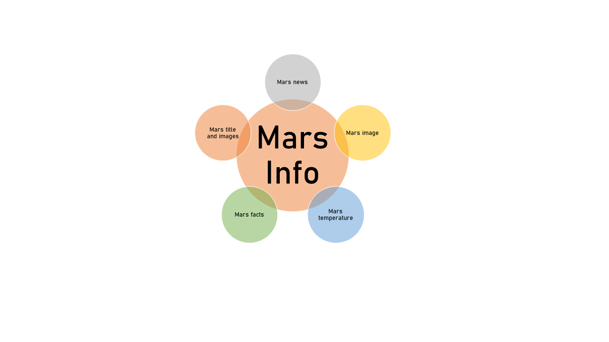

# Web Scraping

### 1. Background 

**Project Background:** In this web scraping project, we will scrape Mars Info from public domain websites, store it in database, and put it in HTML. 

### 2. Methodology

**Methodology:** For web scraping, we will use Python (with additional library of Pandas, splinter). For database, we will use MongoDB and later on we will utilize Flask app to load it in html. 

### 3. Data Source

**Mars Info Data:** We will take several pieces of mars info. This part really taught our skill to do web scraping from various websites with their own unique HTML data structure. 

1. Mars news: 'https://www.jpl.nasa.gov/spaceimages/?search=&category=Mars'
2. Mars image: 'https://www.jpl.nasa.gov/spaceimages/images/largesize/PIA16225_hires.jpg'
3. Mars weather: 'https://twitter.com/marswxreport?lang=en'
4. Mars facts: 'https://space-facts.com/mars/'
5. Mars hemisphere: 'https://astrogeology.usgs.gov/search/results?q=hemisphere+enhanced&k1=target&v1=Mars'

### 4. Result

* File output for web scraping is  `scrape_mars.py` 
* File output for database and Flask app is `app.py` 
* File output for html is `index.html` under folder Templates 

